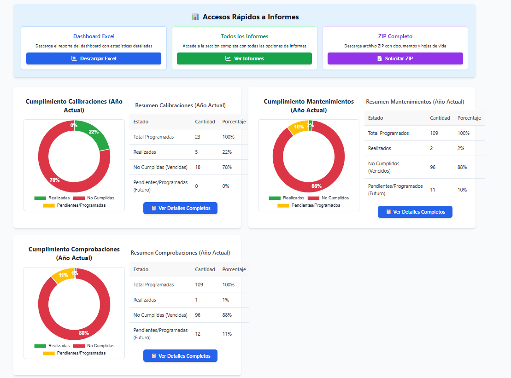

# SAM Metrología - Sitio Web Corporativo

Página web profesional para SAM Metrología S.A.S.

## 📁 Estructura del Proyecto

```
sam-website/
├── index.html                 # Página principal
├── assets/
│   ├── css/
│   │   └── style.css         # Estilos personalizados
│   ├── js/
│   │   └── main.js           # Funcionalidad JavaScript
│   └── images/
│       └── logo.png          # Logo de la empresa
└── README.md                 # Este archivo
```

## 🎨 Cómo Agregar Imágenes Reales

### Opción 1: Capturas de Pantalla de la Plataforma SAM

1. **Toma capturas de pantalla** de tu plataforma SAM en producción:
   - Dashboard principal (tamaño recomendado: 1600x1000px)
   - Página de gestión de equipos (tamaño recomendado: 800x600px)
   - Página de reportes (tamaño recomendado: 800x600px)

2. **Guarda las imágenes** en la carpeta `assets/images/` con estos nombres:
   - `dashboard.png` o `dashboard.jpg`
   - `equipos.png` o `equipos.jpg`
   - `reportes.png` o `reportes.jpg`

3. **Reemplaza los placeholders** en `index.html`:

   **Encuentra esta sección** (línea ~193):
   ```html
   <div class="showcase-placeholder">
       <svg viewBox="0 0 800 500" xmlns="http://www.w3.org/2000/svg">
           ...
       </svg>
   </div>
   ```

   **Reemplázala con**:
   ```html
   <div class="showcase-image">
       
   </div>
   ```

4. **Agrega este CSS** en `assets/css/style.css` (después de `.showcase-placeholder`):
   ```css
   .showcase-image {
       width: 100%;
       overflow: hidden;
   }

   .showcase-image img {
       width: 100%;
       height: 100%;
       object-fit: cover;
       display: block;
   }
   ```

### Opción 2: Usar Imágenes de Stock (Temporalmente)

Sitios recomendados para imágenes gratuitas de alta calidad:
- [Unsplash](https://unsplash.com/) - Busca: "dashboard", "analytics", "technology"
- [Pexels](https://www.pexels.com/) - Busca: "computer screen", "data analysis"
- [Freepik](https://www.freepik.com/) - Busca: "metrology", "measurement tools"

## 🎥 Cómo Agregar un Video Demostrativo

### Paso 1: Preparar el Video

1. **Graba un video corto** (15-30 segundos) mostrando:
   - Login a la plataforma SAM
   - Navegación rápida por el dashboard
   - Ejemplo de uso de una funcionalidad clave

2. **Optimiza el video**:
   - Formato: MP4 (H.264)
   - Resolución: 1280x720px o 1920x1080px
   - Duración: 15-30 segundos
   - Tamaño: Menos de 5MB

3. **Herramientas gratuitas** para optimizar:
   - [HandBrake](https://handbrake.fr/) - Compresor de video
   - [CloudConvert](https://cloudconvert.com/) - Convertidor online

### Paso 2: Agregar el Video al Sitio

1. **Guarda el video** como `assets/images/demo-sam.mp4`

2. **Agrega esta sección** en `index.html` (después de la sección Showcase):

   ```html
   <!-- Video Demo Section -->
   <section class="video-demo">
       <div class="container">
           <div class="section-header">
               <h2 class="section-title">Mira SAM en Acción</h2>
               <p class="section-subtitle">Un vistazo rápido a nuestra plataforma</p>
           </div>
           <div class="video-wrapper">
               <video controls poster="assets/images/video-poster.jpg">
                   <source src="assets/images/demo-sam.mp4" type="video/mp4">
                   Tu navegador no soporta el elemento de video.
               </video>
           </div>
       </div>
   </section>
   ```

3. **Agrega estos estilos** en `assets/css/style.css`:

   ```css
   /* Video Demo Section */
   .video-demo {
       padding: 100px 0;
       background: var(--gray-light);
   }

   .video-wrapper {
       max-width: 900px;
       margin: 0 auto;
       border-radius: 16px;
       overflow: hidden;
       box-shadow: var(--shadow-xl);
   }

   .video-wrapper video {
       width: 100%;
       height: auto;
       display: block;
   }
   ```

### Opción Alternativa: Usar YouTube

Si prefieres subir el video a YouTube:

1. **Sube tu video** a YouTube
2. **Copia el código de inserción** (Share → Embed)
3. **Reemplaza** el código del video con:

   ```html
   <div class="video-wrapper">
       <iframe
           width="100%"
           height="500"
           src="https://www.youtube.com/embed/TU_VIDEO_ID"
           frameborder="0"
           allow="accelerometer; autoplay; clipboard-write; encrypted-media; gyroscope; picture-in-picture"
           allowfullscreen>
       </iframe>
   </div>
   ```

## 🚀 Visualizar los Cambios

1. **Abre el archivo** `index.html` en tu navegador
2. **O usa un servidor local** (recomendado):
   ```bash
   # Con Python
   python -m http.server 8000

   # Con Node.js
   npx serve
   ```
3. **Navega a** `http://localhost:8000`

## ✅ Checklist de Personalización

- [x] Logo agregado
- [x] Información de contacto actualizada
- [x] Trial gratuito destacado
- [x] Normas actualizadas (ISO/IEC 17020, ILAC-G24, OIML D10, ILAC-G8)
- [ ] Capturas de pantalla de la plataforma
- [ ] Video demostrativo
- [ ] Testimonios de clientes (opcional)
- [ ] Casos de éxito (opcional)

## 📞 Contacto

Para cualquier duda sobre la personalización del sitio, contacta a:
- Email: metrologiasam@gmail.com
- WhatsApp: +57 324 799 0534

## 📝 Próximos Pasos para Publicar

Una vez que tengas todas las imágenes y contenido:

1. **Crear repositorio en GitHub**
2. **Subir archivos**
3. **Activar GitHub Pages**
4. **Tu sitio estará en:** `sam-metrologia.github.io`

¡Listo para seguir con la publicación cuando lo desees!
